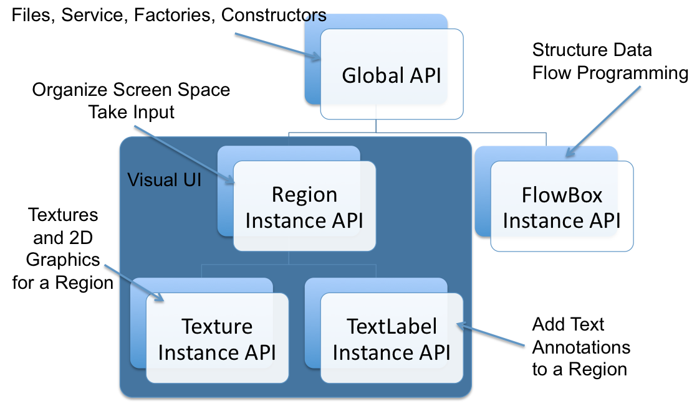

urMus API Overview
============
This document provides a high-level overview of the different objects present
in the urMus system. Currently the API is alpha grade. This means that any aspect of it is subject to change in future revisions. However large parts of the API are designed as intended and we expect good parts of it to remain stable. Aspects that are replaced or extended will likely have functionaly equivalent ways to achieve what the current API offers.

### Current Version
urMus 0.9.8alpha.

### Authors
This documentation was written by Bryan Summersett and Georg Essl. Thanks to [many many contributors](Credits.html)!

Overview
===========

The urMus API is organized as follows. There are a set of global function. These have the character that they do not require the creation of instances and address a range of aspect such as system-centric functions like file access, or support for networking, as well as functions to generate instances. There are currently two main groups of instanced APIs, Regions and Flowboxes. Regions address all aspects of visual output and interaction. Flowboxes are the building blocks of the multi-media dataflow pipeline allowing for the generation of audio and other output. Regions have subinstancing APIs for textures and textlabels. The API hierarchy is depicted below.

2D Interface and Interaction API
=============
 
[Region](Region.html)
------------
A [Region](Region.html) is the visual and multi-touch interaction unit of urMus. It serves as the basic unit for mapping
graphic objects onto the display as well as the recipient of multi-touch and other interaction events. It can serve as a parent object for other regions,
or as a container for a [Texture](Texture.html) or a [TextLabels](TextLabel.html). The UIParent region is immutable and
is created by the urMus system. 

[Texture](Texture.html)
---------------
Textures provide visual detail to regions.

[TextLabel](TextLabel.html)
---------------
TextLabel provides text display to a region.

FlowBox API
===========

[Flowbox](Flowbox.html)
------
The [Flowbox](Flowbox.html) is the fundamental unit of audio / data within urMus. This object can serve 
as a data source, a manipulator, or sink (outlet) and be connected vis push or pull
links to other flowboxes, forming a graph of input -> output commands. 

[Global Flowboxes](FlowboxList.html)
---------
A number of [Flowbox](FlowboxList.html) units are provided by urMus.

Global API
==========

[Global API](globalAPI.html)
---------
The global API provides service functions or functions not associated with any instanciated object.

[urMus documentation](../documentation.html)
